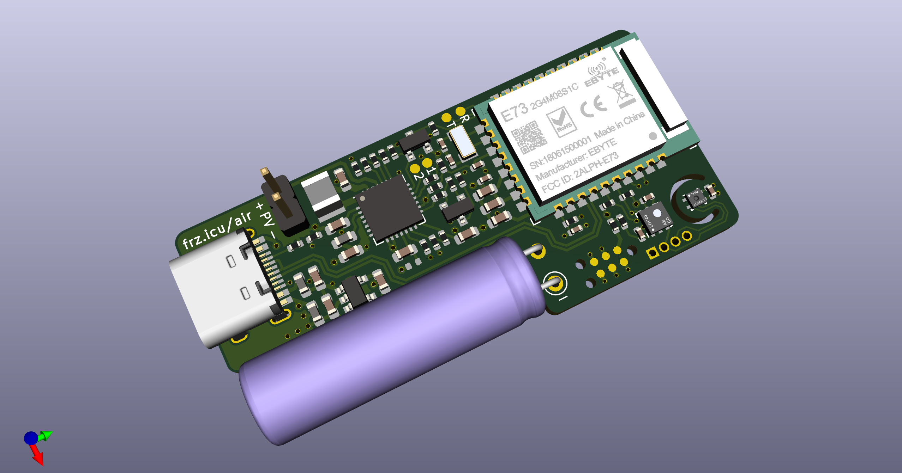

# Air Sensor V1.0
A small solar powered ZigBee compatible sensor for temperature, humidity and VOCs.  
Features nRF52840, AEM10941, SHT40 and SGP40.

## Voltage dividers
Due to the extremely high resistor values and their corresponding errors, the set voltage limits are very inaccurate. 

## Software
In progress™.

## BOM
The interactive BOM can be found [here](https://franz.science/airsensor-v1.0-ibom/).  

## Reference
e-peas Configuration tool (for the resistors) in the resources section: [Product page](https://e-peas.com/product/aem10941/).